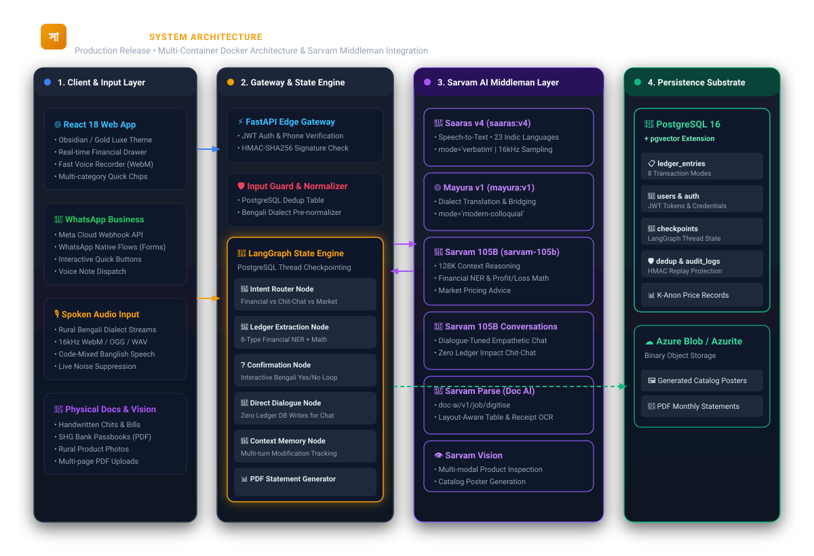
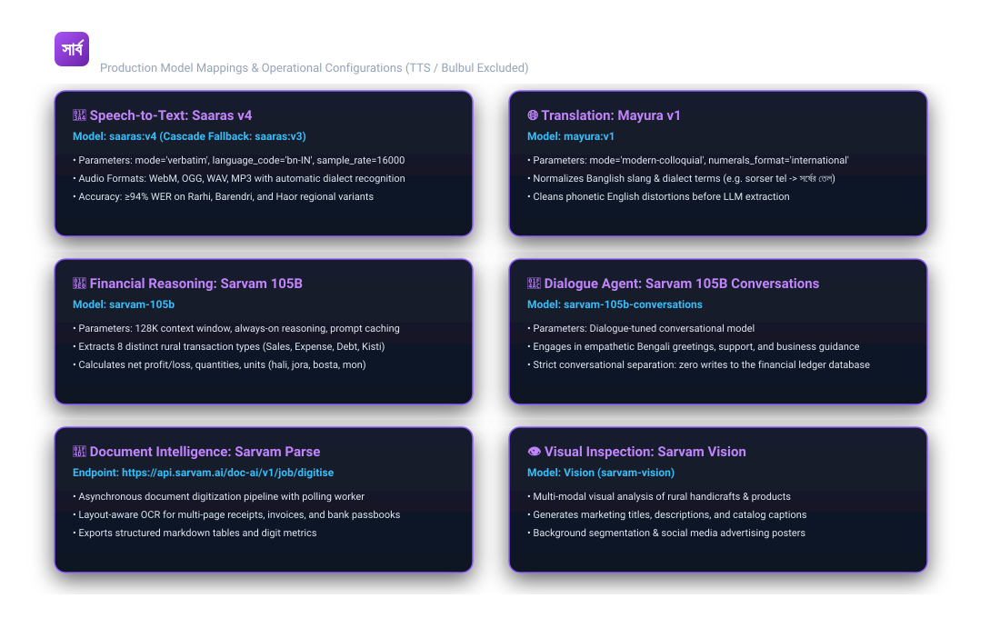
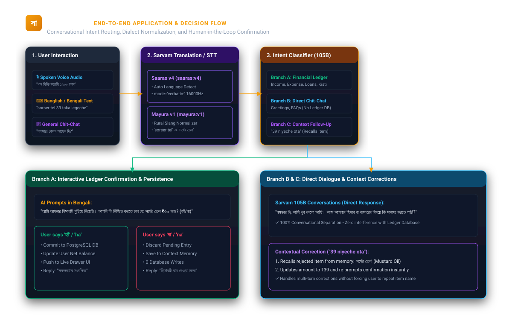

<h1 align="center">
  AI-SATHI (AI-সাথী)
</h1>

<p align="center">
  <strong>Voice-first Web UI financial assistant for rural micro-entrepreneurs</strong>
</p>

<p align="center">
  
  
  
  
  
  
  
  
</p>

---

## What is AI-SATHI?

AI-SATHI is a production-grade, voice-first Web UI financial assistant built for Self-Help Group (SHG) women in West Bengal. It processes Bengali voice notes into structured ledger entries, generates bank-submittable PDF reports, creates product catalogs with AI-powered pricing, and provides market trend analysis. Hosted seamlessly on Microsoft Azure via GCP pipelines and accessed securely through `kothakhata.app`.

- **Web-native UI**: Interactive React + Vite frontend accessible directly in the browser via `kothakhata.app`
- **Sarvam AI exclusive**: Zero OpenAI dependency - uses `saaras:v4`, `mayura:v1`, `sarvam-105b`, `sarvam-105b-conversations`, `Parse`, and `Vision`
- **Self-hosted fallback**: Local Ollama + `faster-whisper` keeps every feature alive during API outages
- **390 offline tests**: Full security, edge-case, and behavioral coverage with no network required

## Architecture

<p align="center">
  
</p>

<details>
<summary><strong>Sarvam AI Middleman Stack</strong></summary>
<br>
<p align="center">
  
</p>
</details>

<details>
<summary><strong>End-to-End Decision Flow</strong></summary>
<br>
<p align="center">
  
</p>
</details>

**In one paragraph:** `backend/services/gateway` is the FastAPI webhook receiver - it verifies Meta's HMAC signature, deduplicates retried webhooks, rate-limits per number, and hands off to Celery. `backend/services/orchestrator` is a LangGraph state machine (Postgres-checkpointed, resumable) with one node per agent. `backend/services/orchestrator/model_router.py` is the single place any LLM/vision/translation call goes through - a Sarvam-to-local-Ollama cascade with retries and hard timeouts. `backend/shared/knowledge/` is the single source of cultural/seasonal/market-timing context every agent reads from.

## Features

| Module | Description |
|---|---|
| **Voice Ledger** | Bengali voice note - structured income/expense extraction - confirm/correct loop - database write - bank-submittable PDF |
| **Catalog Creator** | Product photo - background removal - vision product ID - dual Bengali captions - price suggestion - composited ad poster |
| **Friend-style Pricing Chat** | Warm conversational back-and-forth to agree an asking price before poster composition |
| **Pricing Recommendation** | Deterministic price-floor math from seller's cost, margin, and minimum - Sarvam phrases, never generates numbers |
| **Negotiation** | Code-enforced price floor, deterministic counter-offers, post-generation safety scan, tactic selection from playbook |
| **Market Predictor** | k-anonymized ledger aggregation + Agmarknet mandi data + crop calendar = trend advice |
| **Government Scheme RAG** | Hallucination-guarded per-chunk grounding verification (ships with no pre-filled content by design) |
| **Cross-agent Verification** | Independent second-pass dignity/numeric check on highest-stakes messages |

## Quick Start

```bash
# 1. Clone and configure
git clone https://github.com/AkashKundu114/AI-SATHI.git
cd AI-SATHI
cp .env.example .env
# Edit .env - fill in SARVAM_API_KEY and WhatsApp credentials

# 2. Launch the full stack
docker compose up --build -d

# 3. Access the app
open http://localhost:8000
# Default login: admin / admin
```

### Prerequisites

| Requirement | Notes |
|---|---|
| **Docker & Docker Compose** | Runtime dependencies for the full stack |
| **Microsoft Azure VM** | To host the platform with the domain `kothakhata.app` |
| **GitHub Actions** | Automated CI/CD deployment pipeline |
| **Sarvam AI key** | Sole paid AI vendor (`sarvam.ai`) |
| **Ollama** (recommended) | Self-hosted fallback for API outages. Pull `nomic-embed-text` for RAG embeddings |

## Repository Structure

```
AI-SATHI/
 backend/
   services/
     gateway/            # FastAPI webhook receiver + WhatsApp Flow handlers
     orchestrator/       # LangGraph state machine + model router
       nodes/            # Feature agents (ledger, catalog, pricing, negotiation, ...)
     translation_service/  # Sarvam client (chat, vision, translate)
     voice_gateway/      # saaras:v4 - faster-whisper STT cascade
     pdf_service/        # Bank-submittable monthly report generation
     vision_service/     # Catalog image processing + ad poster composition
     rag_service/        # Hybrid retrieval + per-chunk grounding verifier
     market_service/     # k-anonymized trend aggregation + Agmarknet
   shared/
     config/             # Settings, feature caps, token budgets
     db/                 # SQLAlchemy models + session management
     guardrails/         # Budget, input/output guards, response cache
     i18n/               # Bengali calendar + number-word helpers
     knowledge/          # Festivals, melas, crop calendar, negotiation playbook
     security/           # Audit log, input sanitizer
   scripts/              # Admin utilities (seed, backup, audit, reports)
 frontend/               # React + Vite chat interface with Bengali fonts
 migrations/             # PostgreSQL migrations (auto-applied on first boot)
 tests/
   unit/                 # 390 offline tests
   integration/          # End-to-end flow tests
   fixtures/             # Test audio/image files
 docs/                   # Architecture, product, security, red-team, runbooks
 .github/workflows/      # CI (test + lint) and Deploy (GHCR + SSH)
```

## Testing

```bash
# Run all 390 tests (no API keys or network required)
python -m pytest tests/ -q

# Quick smoke tests (~2s)
make test-fast

# With coverage
python -m pytest tests/ --cov=shared --cov-report=term
```

## Documentation

| Document | Description |
|---|---|
| [`docs/architecture.md`](docs/architecture.md) | System design, LangGraph FSM, Sarvam middleman stack, Docker setup |
| [`docs/product.md`](docs/product.md) | Product specs for 8 Bengali/Banglish transaction modes |
| [`docs/engineering-review.md`](docs/engineering-review.md) | Test suite audit (390 passed), PostgreSQL tuning |
| [`docs/security.md`](docs/security.md) | JWT auth, rate limiting, HMAC validation, PII masking |
| [`docs/red-team.md`](docs/red-team.md) | Adversarial audit - prompt injection, dialect edge cases |
| [`docs/runbooks/restore.md`](docs/runbooks/restore.md) | Backup/restore and disaster recovery procedures |

## Tech Stack

| Layer | Technology |
|---|---|
| **Runtime** | Python 3.11, FastAPI, Uvicorn |
| **AI Orchestration** | LangGraph (Postgres-checkpointed FSM) |
| **AI Models** | Sarvam AI (`saaras:v4`, `mayura:v1`, `sarvam-105b`, `sarvam-105b-conversations`, `Parse`, `Vision`) |
| **Self-hosted Fallback** | Ollama + `faster-whisper` |
| **Database** | PostgreSQL 16 + pgvector |
| **Messaging** | Meta WhatsApp Cloud API |
| **Frontend** | React + Vite |
| **Infrastructure** | Docker Compose, Caddy (TLS), GitHub Actions CI/CD |
| **Image Processing** | Rembg, Pillow, optional Flux Pro |

## License

AGPL-3.0 - see [LICENSE](LICENSE).

---

<p align="center">
  Built with care for the women who keep India's rural economy moving.
</p>
