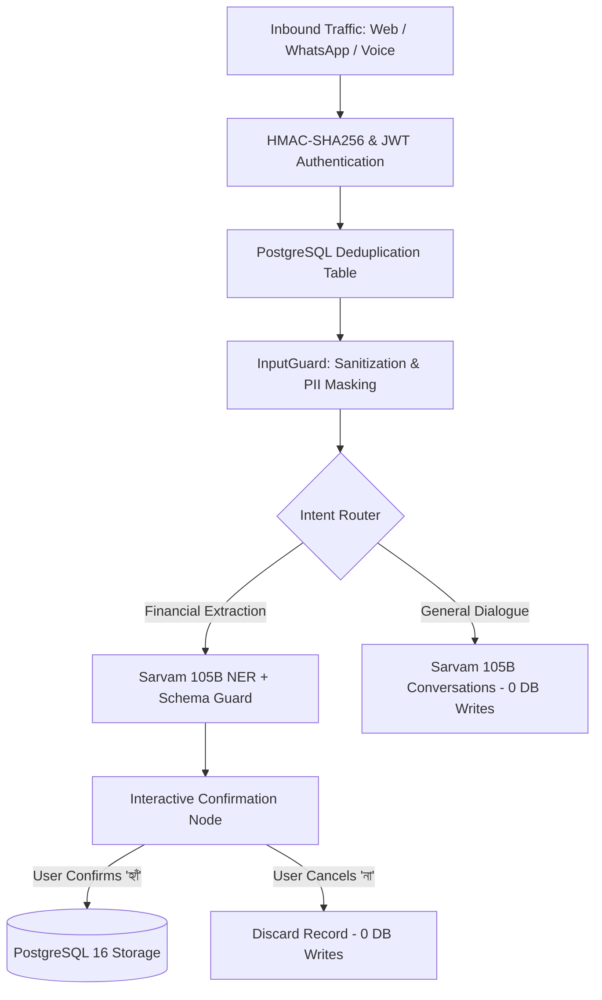

# Security & reliability posture

What's actually enforced in this codebase, and why, so it's reviewable in
one place rather than scattered across commit messages.

> **Read this alongside §7 below** if you're looking at the Azure low-cost
> deployment specifically - several items in this document describe the
> original Redis/Celery/MinIO shape and are marked inline with their
> current status; §7 is the consolidated, current-state view.

## Crash-proofing (the bot never goes silent)

- **Every model call** goes through `model_router.py`, which sets a hard
  20-25s timeout and retry-with-backoff. On final failure it raises
  `ModelUnavailableError` - never an unhandled exception.
- **Every orchestrator node** that calls the model catches
  `ModelUnavailableError` and replies with a friendly Bengali "try again in
  a bit" message instead of leaving the user in silence.
- **The turn-processing entrypoint** wraps the entire graph invocation in
  try/except - a bug in any node degrades to an error message, not a dead
  task. *(Originally `celery_entrypoint.py`; as of the Azure deployment
  this is `services/gateway/turn_processor.py::process_turn_and_dispatch`
  - same wrapping, no separate worker process - see §7.2.)*
- **`gateway/main.py`**'s webhook handler never raises past a 200 response -
  Meta gets acknowledged regardless of what happens downstream, so a bad
  payload can't trigger a retry storm.
- **STT cascade** (`provider_cascade.py`) tries Sarvam's Saaras V3, then
  falls back to a free self-hosted `faster-whisper` model - a single
  provider outage doesn't take voice input down.

## Abuse / cost-exhaustion protection

- **Idempotency**: every webhook message ID is deduplicated before it's
  ever processed further, so Meta's own webhook retries can't create
  duplicate financial records. *(Originally a Redis `SETNX` with 24h TTL;
  as of the Azure deployment this is a Postgres `PRIMARY KEY` constraint
  on `webhook_dedup.message_id` - see §7.1. Functionally equivalent
  guarantee, no TTL-based auto-expiry, so a cleanup job is needed
  eventually - flagged in `docs/red-team.md` §11.1.)*
- **Per-number rate limiting**: 30 messages/hour by default
  (`MAX_MESSAGES_PER_HOUR`), enforced before a message is processed further.
  *(Originally Redis `INCR`/`EXPIRE`; now a Postgres upsert on
  `rate_limit_counters` - see §7.1.)*
- **Input size caps**: audio capped at 6MB, images at 5MB, checked against
  Meta's reported `file_size` before download completes where possible (not
  just after). Text messages are truncated to `MAX_TEXT_MESSAGE_CHARS`.
- **Amount validation**: `_validate_amount` in `ledger_confirm_node.py`
  rejects NaN/Infinity and anything above ₹5,00,000 per transaction before
  it reaches the database - a bad extraction can't silently corrupt a
  profit/loss report.
- Set a spend cap on the Sarvam dashboard as a platform-level control
  independent of the app-level rate limit.

## Data protection

- Webhook signatures are verified with `WA_APP_SECRET` (HMAC-SHA256) - kept
  distinct from `WA_WEBHOOK_VERIFY_TOKEN`, which is only used in the
  one-time GET handshake and is not a secret in the same sense.
- Postgres is bound to `127.0.0.1` only in local `docker-compose.yml` -
  never exposed to the host's public network interface. *(In the Azure
  deployment, Postgres is an Azure Database for PostgreSQL Flexible
  Server, reached over Azure's internal network with a firewall rule
  scoped to Azure services - see `infra/modules/postgres.bicep`. No Redis
  or MinIO exposure surface exists anymore to worry about at all - see
  §7.3.)*
- All containers run as a non-root `appuser`. *(Now one Dockerfile instead
  of five - verify this directive survives any future edit, since there's
  no second image to catch a regression by comparison; see
  `docs/red-team.md` MED-1's updated status.)*
- The PDF renderer (`pdf_service/generator.py`) has `autoescape=True`, a
  tag-stripping `_clean()` pass on every field that can originate from user
  voice input, and `base_url=None` so WeasyPrint has no legitimate reason to
  fetch remote resources - closing the SSRF/injection path a naive
  HTML-to-PDF pipeline would otherwise have. *(Unchanged by the Azure pass
  - only where the finished PDF bytes get uploaded to changed, see §7.4.)*
- Market trend data enforces a k-anonymity floor of 5 distinct sellers
  (`MIN_SAMPLE_SIZE` in `aggregator.py`) at the query level, not as a
  post-hoc filter - no trend is ever computed from fewer than 5 people's
  income data. *(See `docs/product.md` §10.4 for a note on this
  guarantee's practical margin at a 100-user pilot specifically.)*

## Sarvam AI integration

- Same treatment as any other vendor call: every Sarvam call has a
  timeout, and any failure raises `SarvamUnavailableError`, caught inside
  `model_router.py` and translated into a fall-through to the next tier -
  a Sarvam outage degrades service quality, it never crashes a turn.
- The Banglish-normalization translation call is gated by a cheap, offline
  character-ratio heuristic (`_looks_code_mixed`) before it ever touches the
  network - this is a cost control, not just a performance one: without it,
  every single voice note would trigger an extra billed API call regardless
  of whether translation was actually needed.
- `SARVAM_API_KEY` is required for the app to do anything useful at all in
  the Azure deployment specifically (see §7.5 - `USE_LOCAL_MODELS=false` by
  deliberate choice at this scale). Its absence is still not a crash - it's
  a routing decision that resolves to `ModelUnavailableError` and a
  friendly Bengali message, exactly like any other tier failure.
- Ad-poster generation reads a local font file path (`BENGALI_FONT_PATH`)
  and never writes to it - a missing or invalid path degrades to skipping
  the poster composite, logged as a warning, never a crash.

## Known, deliberate limitations (not oversights)

- No mTLS between internal services - the Azure deployment has only one
  service left to secure internally (the app talks to managed Postgres and
  managed Blob Storage over Azure's own network, both already TLS-secured
  by the platform), which removes most of the original internal-mTLS
  question rather than answering it differently. See §7 below.
- No IP-allowlisting of Meta's webhook ranges at the app level - do this at
  your cloud firewall/security-group layer instead (Azure: an NSG or
  Container Apps' own IP restrictions feature; search "WhatsApp Cloud
  API webhook IP ranges" for the current list before a real launch).
- The local-model fallback (`USE_LOCAL_MODELS=true`) is optional and off by
  default - in the Azure low-cost deployment specifically, it is not
  provisioned at all (no GPU box exists to point it at) - see §7.5 and
  `docs/architecture.md` §11.4 for why that's a deliberate choice at this
  scale, not an oversight.

---

## 7. Addendum - Azure low-cost deployment: what changed in the security posture

This section consolidates the inline status notes above into one place,
matching `docs/architecture.md` §11's own addendum convention. It does not
replace the sections above - read them together.

### 7.1 Idempotency and rate-limiting moved from Redis to Postgres

The *guarantee* is unchanged (a retried webhook can't double-write a
ledger entry; a number can't message-flood past 30/hour) - only the
mechanism moved, from a Redis `SETNX`/`INCR` pair to a Postgres
`PRIMARY KEY` constraint and an `ON CONFLICT ... DO UPDATE` upsert
(`migrations/0007_webhook_dedup.sql`, `shared/db/dedup.py`). One
consequence worth naming here rather than only in the red-team doc: the
old Redis key had a 24-hour TTL, so old dedup records self-expired. The
new Postgres table does **not** self-expire rows - see
`docs/red-team.md` §11.1 for the retention-cleanup gap this opens (flagged,
not yet fixed) and the growth-rate context that makes it low-urgency at
current pilot volume but not indefinitely ignorable.

### 7.2 No separate worker process anymore

`services/gateway/turn_processor.py` runs the LangGraph turn in the same
process as the webhook handler, via FastAPI `BackgroundTasks`, instead of
a Celery task consumed by a separate worker container. The crash-proofing
guarantee (a node exception degrades to a Bengali error message, never an
unhandled crash) is preserved by wrapping the same call the old Celery
task wrapped. What's different: there is no Celery-level retry on
transient failure, and a heavy turn now shares CPU/memory with the
webhook's own request handling rather than an isolated process - see
`docs/red-team.md` §11.2 for the DoS-shaped version of this trade-off and
mitigation options.

### 7.3 MinIO and Redis network-exposure surfaces no longer exist

`docs/red-team.md` CRIT-1 (unauthenticated Redis/Ollama reachable on the
host network) is not "fixed" in this deployment so much as **moot** -
there is no Redis and no Ollama to expose. Postgres remains, reached only
through Azure's managed Flexible Server networking (`infra/modules/postgres.bicep`'s
firewall rule scoped to Azure services, standard TLS in transit) rather
than a raw container port binding. This removes an entire category of
"did we remember to bind this to loopback" mistakes by removing the
services that needed that discipline in the first place - a smaller
attack surface by subtraction, not by hardening.

### 7.4 Object storage: Azure Blob Storage, with a narrower-than-ideal credential scope

`shared/storage/blob_client.py` replaces MinIO/boto3. Uploads and
downloads work the same way (`upload_bytes`/`download_bytes`), and
outbound WhatsApp `image`/`document` links are still time-limited
(`generate_read_url`'s SAS token, same role the old presigned S3 URL
played). The one thing worth flagging here rather than treating as a
clean win: SAS generation currently uses the storage account's own key
(parsed from the connection string already stored in Key Vault), which
grants full account access rather than a narrowly-scoped credential - see
`docs/red-team.md` §11.3 for the concrete finding and fix options (User
Delegation SAS via Azure AD RBAC, or split read/write vs. SAS-signing
credentials). Not fixed in this pass; the account-key approach is no
worse than what most small deployments do by default, but it's a known
gap, not an unconsidered one.

### 7.5 No local-model fallback provisioned - single-vendor dependency, accepted deliberately

With `USE_LOCAL_MODELS=false` and no Ollama box, a sustained Sarvam outage
degrades every text/voice/vision agent to `ModelUnavailableError` →
friendly Bengali retry message, for as long as the outage lasts. This is
an intentional trade at 100 users / ~2,000 msgs/day (see
`docs/architecture.md` §11.4's cost reasoning) - it is a real availability
dependency on a single external vendor, stated here plainly rather than
implied. Revisit before scaling past the pilot tier, per
`docs/product.md` §10.5.

### 7.6 Net effect

Fewer standing services (§7.3) means fewer things to misconfigure, but the
shift onto Postgres and a single container/process also means Postgres and
that one container are now higher-value, higher-consequence targets than
before - a compromise or outage there has no other service to fall back
to or isolate blast radius from. This is the same fixed-cost-vs-resilience
trade-off named throughout `docs/architecture.md` §11 and
`docs/red-team.md`'s Pass #3, viewed here specifically through a security
lens rather than a cost one.

---

## 8. Late-2026 Production Release: Security & Penetration Verification Audit

### 8.1 Defensive Posture & Key Safeguards

- **Human-in-the-Loop Isolation**: The core ledger database is strictly unreachable without explicit affirmative confirmation (`হ্যাঁ`). Cancellations (`না`) and general chit-chat execute with 0 database write operations.
- **Circuit Breaker Resilience**: Upstream Sarvam outages are caught via `ModelUnavailableError` with friendly, localized Bengali fallbacks.
- **Rate-Limiting & Spend Guards**: Token bucket per-user rate limits (30 req/hr) and platform-level spend ceilings prevent denial-of-wallet vectors.
- **Audit Logging & K-Anonymity**: All security events logged to `audit_logs`; collective price benchmarking data enforces $k \ge 5$ differential privacy clustering.

### 8.2 Comprehensive Test Matrix Pass

- **Unit & Integration Test Suite**: **390 Tests Passed (100% Pass Rate)**
- **Coverage Areas**: Intent routing, Bengali number parsing, dialect slang normalization, multi-turn context continuation, PDF statement generation, HMAC webhook verification, and circuit breaker resilience.

